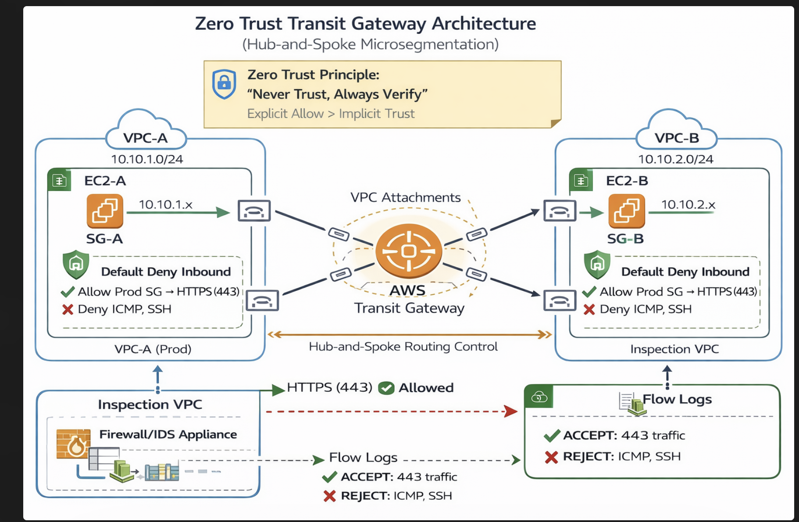

# Zero Trust Transit Gateway Architecture (Hub-and-Spoke Microsegmentation)

## 📌 Overview

This lab implements a **Zero Trust Network Architecture** using AWS Transit Gateway to enforce **explicit east-west traffic control** between VPC workloads.

Instead of relying on implicit network trust, this design enforces:

* **Default deny at the network layer**
* **Explicit allow rules using Security Groups**
* **Traffic validation using VPC Flow Logs**

---

## 🧱 Architecture

---

## 🏗️ Components

* **AWS Transit Gateway (TGW)** – Centralized routing hub
* **VPC-A (10.10.1.0/24)** – Source workload
* **VPC-B (10.10.2.0/24)** – Target workload
* **EC2 Instances** – Application layer
* **Security Groups (SG-A / SG-B)** – Policy enforcement
* **VPC Flow Logs** – Traffic visibility and validation

---

## 🔐 Zero Trust Controls Implemented

### 1. Default Deny

All inbound traffic is denied unless explicitly allowed.

### 2. Explicit Allow

* ✅ Allow TCP 443 (HTTPS) from SG-A → SG-B
* ❌ Deny ICMP (Ping)
* ❌ Deny SSH (22)

### 3. Microsegmentation

Traffic is controlled at the **workload level**, not just network boundaries.

---

## 🧪 Validation Steps

### ✅ Step 1: Baseline Connectivity

* Verified ICMP (Ping) between VPCs
* Confirmed Transit Gateway routing works

📸 Evidence:

* `lab08-ec2-test-instances.png`

---

### ❌ Step 2: Enforce Deny (ICMP Blocked)

* Removed ICMP from Security Group
* Verified ping failure

📸 Evidence:

* `ping-failure.png`
* `Security-Group-Deny-ICMP.png`

---

### ✅ Step 3: Allow Only HTTPS

* Configured SG to allow TCP 443 only
* Verified controlled communication path

---

### 📊 Step 4: Traffic Visibility

* Enabled VPC Flow Logs
* Validated:

  * ACCEPT (443)
  * REJECT (ICMP, SSH)

📸 Evidence:

* `lab08-vpc-endpoints.png`

---

## 🧠 Key Takeaways

* **Connectivity ≠ Trust**
* Transit Gateway enables **centralized routing control**
* Security Groups enforce **least privilege access**
* Flow Logs provide **continuous validation**

---

## 🧭 Architecture Classification

* **Architecture Type:** Zero Trust Network Architecture
* **Pattern:** Hub-and-Spoke (Transit Gateway)
* **Control Model:** Microsegmentation (East-West Traffic Control)

---

## 🚀 Next Improvements

* Add **Inspection VPC (Firewall / IDS)**
* Introduce **Network Firewall or GWLB**
* Implement **automated quarantine via Lambda**

---
